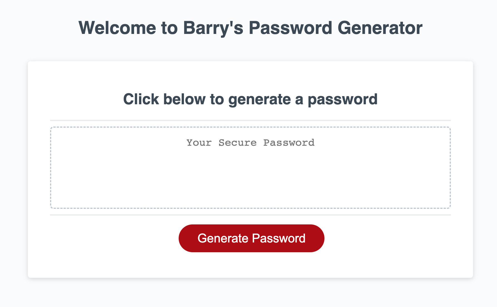

# Password-Generator

## Description 

This webpage contains code for a webpage that can generate a customised password based on criteria specified by the user through various prompts. I have written the additional JavaScript code to fulfil the requirements as well as making some very slight HTML and CSS updates to provide more guidance to the user. It has been a great opportunity for me to apply the knowledge learned over the last week to instruct the computer to carry out instructions following inputs from the user.

Following this task, I've certainly enhanced my skills to utilise JavaScript and the relevant methods to build this password generator. I went above and beyond by increasing the randomness of the password by ensuring that the order in which the character types were appearing were completely random, therefore reducing the likelihood of any brute force password cracking.

### Useful Links
[GitHub Repository: Password-Generator](https://github.com/barrylui88/05-Password-Generator/)

[Deployed Page (powered by GitHub Pages)](https://barrylui88.github.io/05-Password-Generator/)

## Installation

No installation is required - simply follow the URLs I have included above.

## Screenshot

The webpage is simple and guides the user to click the button to gather the criteria and generate the password.

## License

MIT License

Copyright (c) 2023 Barry Lui

Permission is hereby granted, free of charge, to any person obtaining a copy
of this software and associated documentation files (the "Software"), to deal
in the Software without restriction, including without limitation the rights
to use, copy, modify, merge, publish, distribute, sublicense, and/or sell
copies of the Software, and to permit persons to whom the Software is
furnished to do so, subject to the following conditions:

The above copyright notice and this permission notice shall be included in all
copies or substantial portions of the Software.

THE SOFTWARE IS PROVIDED "AS IS", WITHOUT WARRANTY OF ANY KIND, EXPRESS OR
IMPLIED, INCLUDING BUT NOT LIMITED TO THE WARRANTIES OF MERCHANTABILITY,
FITNESS FOR A PARTICULAR PURPOSE AND NONINFRINGEMENT. IN NO EVENT SHALL THE
AUTHORS OR COPYRIGHT HOLDERS BE LIABLE FOR ANY CLAIM, DAMAGES OR OTHER
LIABILITY, WHETHER IN AN ACTION OF CONTRACT, TORT OR OTHERWISE, ARISING FROM,
OUT OF OR IN CONNECTION WITH THE SOFTWARE OR THE USE OR OTHER DEALINGS IN THE
SOFTWARE.